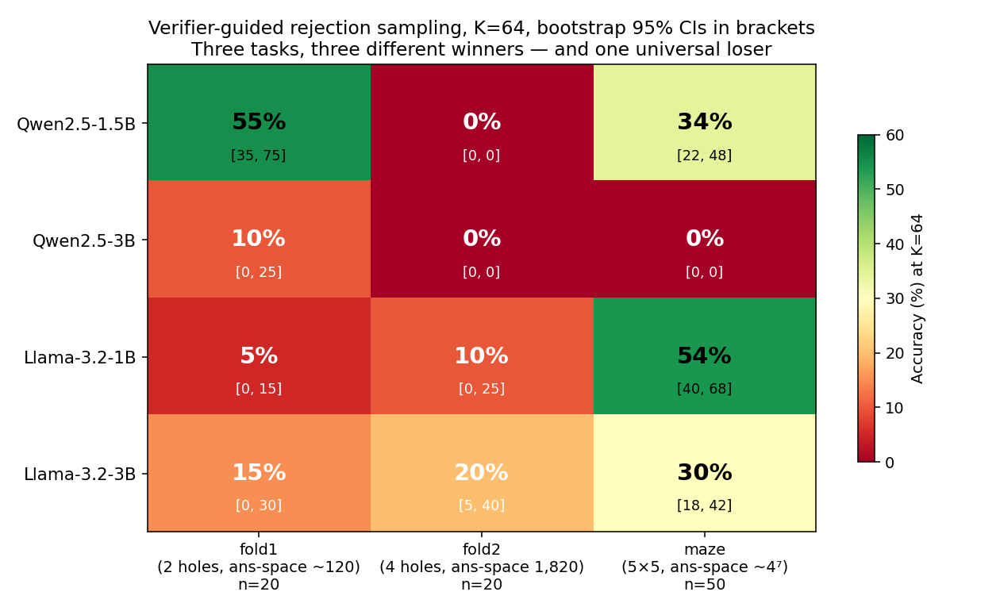

# A Monitor Cannot Rescue What the Model Cannot Produce
### Three tasks, three winners in best-of-K scaffolding

There is a common implicit picture of LLM monitoring as a *selection problem*: the model produces outputs, a monitor scores them, and unsafe outputs are filtered out. Under this picture, a sufficiently strong monitor can rescue an unaligned model — give it a few tries, score them, return the good one. Best-of-K with a perfect verifier is the *upper bound* of what this picture can achieve.

I wanted to actually measure that upper bound. Not at frontier scale — I don't have the compute — but at small scale, on a 16 GB laptop, where I could run real cross-model comparisons in one weekend on $0.

The headline result is that the upper bound is **deeply task- and model-dependent**, and the dependencies don't follow the patterns you'd expect.

Across four small open-weight LLMs (Qwen2.5 and Llama-3.2 at 1.5B-and-3B-class) and three procedural tasks with hand-written physics verifiers, **no model wins more than one task** under verifier-guided rejection sampling at K=64. Qwen2.5-1.5B dominates the easy paper-folding task; Llama-3.2-3B is the only model with meaningful accuracy on the hard paper-folding task; and Llama-3.2-1B — the smallest model in the matrix — wins on the maze task, which has the largest answer space. Bootstrap 95% CIs (n=20 for the fold tasks, n=50 for the maze row) confirm the cell-level winners are statistically separable, not noise dressed as a pattern.

The implication for monitoring-as-selection: **a monitor cannot rescue behavior the model cannot produce**, and which behaviors a model can produce depends on the task structure in a way that doesn't correlate with parameter count. Model choice is upstream of what monitoring can fix.

## The setup

The harness is intentionally minimal. Two tasks come from the spatial-reasoning literature:

- **Paper folding** (a stripped-down version of [MentalBlackboard](https://arxiv.org/abs/2602.19357), which itself adapts the psychometric Paper Folding Test). A 4×4 grid is folded one or two times, a single hole is punched through the stacked layers at a specified position, and the model is asked where the holes appear on the unfolded paper.
- **Maze navigation** on a procedurally generated 5×5 grid. The model is given the maze as ASCII, asked for a U/D/L/R path from start to goal.

Both tasks have **deterministic physics-based verifiers** that independently simulate the answer from the inputs — no precomputed-answer leakage. A path either reaches the goal traversing open cells, or it doesn't. A set of unfolded holes either re-folds to the punched position with no missing or extra cells, or it doesn't.

The scaffold under test is **verifier-guided rejection sampling**: sample up to K responses from the model at temperature 0.8, return the first one the verifier accepts (or the final attempt if none pass). This is the cleanest test bed for "monitor-as-selector" — the verifier is the strongest possible monitor at the output stage (perfect, rule-based, no false positives) and the scaffold lets it pick from K independent draws.

Four models, all served locally via Ollama:

- `qwen2.5:1.5b` (1.3 GB resident)
- `qwen2.5:3b` (2.3 GB resident)
- `llama3.2:1b` (1.6 GB resident)
- `llama3.2:3b` (2.4 GB resident)

These were selected to be the largest text-only models that fit safely on 16 GB unified memory. (Yes, I tried multimodal VLMs first — Qwen2.5-VL-3B turns out to load at 11 GB resident under Ollama, which pushed free RAM to 64 MB on my machine before I killed the run. That was an unintended but informative finding: the resident-size ceiling for local consumer-hardware research is text-only models in the 1.5-3B range.)

## Result 1 — No single model wins more than one task

The headline matrix shows accuracy at K=64 with bootstrap 95% CIs. The pattern is striking:

- **Qwen2.5-1.5B wins fold1** (55% [35, 75]) but collapses to 0% on fold2.
- **Llama-3.2-3B wins fold2** (20% [5, 40]). It's the highest result anywhere on fold2; the next-best is Llama-1B at 10%.
- **Llama-3.2-1B wins maze** (54% [40, 68]), with the 1B parameter count beating every larger model.
- **Qwen2.5-3B loses everywhere** — 10% on fold1, 0% on the other two tasks.

The Llama-1B-vs-Qwen-1.5B maze comparison was the most contested cell. At the initial n=20 it was 50% vs 30% with heavily overlapping CIs ([30, 70] vs [10, 50]). Running n=50 on the full maze row tightened the picture: 54% [40, 68] vs 34% [22, 48]. The lower CI bound of the Llama-1B mean is *above* the point estimate of Qwen-1.5B, so the 20-pp lead is statistically meaningful at n=50 — not n=20 noise.

## Result 2 — Coverage, not selection, is the limit

How do I know the bottleneck is the model's sampling distribution rather than the verifier's selection?

Because I tried a stronger selector and it didn't help.

The verifier is binary — a sample either passes or fails. I also implemented a **soft scorer** that returns partial credit (count of correctly-identified holes, minus a penalty for spurious extras). Then I implemented a "best of K by soft score" scaffold: generate K samples, score every one, return the highest-scoring. This is the PTRM analog of best-Q@K selection ([Sghaier et al. 2026, arXiv:2605.19943](https://arxiv.org/abs/2605.19943)) — a strictly more powerful selection rule than rejection sampling, since it can pick "almost-correct" answers that the binary verifier rejects.

On fold1 at K=64 with Qwen-1.5B, the binary verifier gets 55%. The soft scorer with the same model and K gets **50%** — within statistical noise. Two PTRM-style selection improvements (soft scoring, partial credit) tracking rejection sampling to within 5pp tells me the plateau is **upstream of selection**: the model is failing to *generate* correct answers, and no scorer can rescue what was never produced.

This matches the K-sweep curve on fold1 (Qwen-1.5B). Accuracy rises log-cleanly from 5% (K=1) → 65% (K=256), then plateaus. If selection were the bottleneck, K=256 with a perfect verifier would approach 100%. The plateau at ~65% says the model can't sample the correct answer for the remaining ~35% of instances, no matter how many tries it gets.

## Result 3 — The smallest model wins on the largest answer space

The Llama-1B-wins-maze finding is counterintuitive enough that I want to flag it explicitly. The maze task has the largest answer space of the three (~4⁷ ≈ 16,000 length-7 paths). Naively, you'd expect the largest model to do best.

What I think is happening is the coverage hypothesis in microcosm. The 1B model has a higher-entropy output distribution: it produces a wider variety of attempted paths, including more wrong ones, but also including more *different* wrong ones. When you give it K shots and accept the first valid path, that diversity translates to higher hit rate on a large answer space.

The 3B Llama compresses its distribution around a smaller set of "templates" that are usually slightly-wrong-in-the-same-way. Its mean wall-clock per K=64 instance was actually *higher* than the 1B (38s vs ~200s vs ~22s vs ~14s for the four models — the 1B's longer time reflects the verifier rejecting more diverse attempts before accepting one).

The Qwen models compress harder still. Qwen-3B confidently produces clean malformed answers like `(3,2);(3,2)` (duplicate hole), `(0,1);(1,1);(2,1);(3,1)` (a 4-hole column when only 2 holes are correct), or `(2,1)` (a single hole, missing the mirror). Same output every time; rejection sampling cannot escape.

This is **mode collapse at the output-template level**, and it gets worse with scale within the Qwen family. The same scaling within Llama doesn't produce the same pathology — Llama-3B is mostly normal-but-weak, not catastrophically collapsed.

## What this means for monitoring

If you think of monitoring as "score outputs and filter the bad ones," the upper bound on what monitoring can do is set by the *support* of the model's output distribution. A verifier-as-monitor can:

- Rescue a model whose distribution sometimes includes the correct/safe answer
- Cannot rescue a model whose distribution excludes the correct/safe answer

The two cases look identical from outside the model, until you crank up K and the second case plateaus while the first case keeps rising.

For alignment work specifically: this is one empirical reason to care about **where in the pipeline the safety property is enforced**. Output-stage monitoring (filter what the model produces) is bounded above by what the model produces. If the model's training has collapsed the distribution onto unsafe templates, an output-stage monitor *cannot* fix that — no matter how powerful the monitor or how large the sampling budget. The fix has to happen upstream: either change what the model produces (training, fine-tuning, decoding-time intervention) or change the model.

A possibly-related observation from this dataset: the model that is *worst* under monitoring-as-selection (Qwen-3B, 0% on two of three tasks) is also the model whose outputs look *cleanest* on inspection. High validity rate, well-formed answers, just systematically wrong. The selection-based monitor sees nothing wrong because the failure mode isn't malformed output — it's confident, well-formed, semantically incorrect output. That pattern should be familiar to anyone working on RLHF reward hacking.

## What would change my mind

n=20 on fold1 and fold2; n=50 on the maze row. The CIs are honest — Qwen-3B fold1 [0, 25] doesn't statistically separate from Llama-3B fold1 [0, 30]. The cell-level winners that *are* statistically meaningful are: Qwen-1.5B fold1, Llama-3B fold2, Llama-1B maze. Everything else is suggestive.

The "Qwen-specific mode collapse" pattern would benefit from a third Qwen size (0.5B or 7B). Right now it's two data points within the Qwen2.5 family. Within Llama-3.2, the pattern is different: 1B and 3B trade wins by task, neither is a universal loser. Could be a family-level training-data difference, could be tokenizer effects, could be sampling-temperature interactions — I don't have the experiments to disambiguate.

The most direct way to break this finding would be to show that the coverage limit is an artifact of my prompting. I tested a few prompt variants on Qwen-3B and the failure mode is sticky — the model produces the same malformed answer templates across phrasings. But I haven't done a systematic prompt-sensitivity study, and someone who did might find that the coverage gap closes substantially.

The work that *would* be needed to make this a real paper, not a blog post: n=50 on all twelve cells (currently only the maze row has it); a third model family (Mistral, Gemma); seed variance across multiple runs of the harness; and a frontier-model row (GPT-5, Claude Opus 4.5, Gemini 3) as a ceiling baseline.

## Where this is heading

The reason I picked paper folding — and not a more abstract reasoning task — is that it's the smallest non-trivial spatial task with a deterministic, physics-based verifier. That property scales. Protein folding is the same task at a different scale of consequence: a structure determined by local rules, predicted by a model that doesn't see the structure directly, and judged by a verifier (a biological assay, or an oracle-grade structural predictor) that can score candidates without itself knowing how to generate them.

The monitor-as-selection bound from this post applies cleanly there. If a sequence-to-structure model's output distribution doesn't include the correct fold, no amount of best-of-K against a perfect structural verifier rescues it. The interesting empirical question is what the coverage-vs-selection curve looks like for protein-design models at frontier scale, where the K=1 floor is higher and the selectors are themselves learned and imperfect (RFDiffusion outputs vs. AlphaFold scoring, for example).

There is an obvious bench-scale analog — an HP-lattice protein-folding task with a contact-energy verifier, run across the same four small LLMs. I deliberately did **not** include it here. HP-lattice has been a CS-meets-biology pedagogical staple since 1985 and is well-represented in training data; a model that "wins" might be retrieving a memorized tutorial, not reasoning. That's a contamination story, not a generalization story, and it would weaken the cross-task argument this post is making rather than strengthen it. The next post is the right place for it, with a contamination-controlled task variant.

What I'd want as Berkeley Lab Visiting Researcher time materializes: the same matrix at frontier scale (GPT-5, Claude Opus 4.X, Gemini 3) against a structural verifier on a held-out fold set, testing whether the *no-model-wins-everything* pattern survives. AI-for-science is going to live or die on whether output-stage selection can pick correct answers from candidate sets in domains where the model produces a correct answer but doesn't know which one it is. This post is one data point. The next is the one that matters.

## Appendix: the methodology

Everything ran on a 16 GB MacBook Air M-series via Ollama. Total cash: $0. Total wall-clock across all experiments: roughly 14 hours, including two near-OOM incidents that taught me the resident-size ceiling (Qwen2.5-VL-3B at 11 GB, killed the run; lesson: always check `ollama ps` SIZE after the first call, not just disk size).

The harness is one Python file per scaffold (`bare`, `self_consistency`, `verifier_guided`, `best_partial`, `whiteboard_of_thought`) plus one per task (`folding.py`, `maze.py`). Verifiers are pure Python — for paper folding, the simulator independently re-applies the fold sequence to the proposed unfolded holes and checks they stack at the punched position. For maze, the verifier walks the proposed move sequence and checks open-cell-only + reaches-goal.

K-sweeps use `--start-seed` to add instances incrementally without re-running the whole sweep; bootstrap CIs use 10,000 resamples per cell with a fixed RNG seed.

Memory-safety is enforced by an `available_gb < 1.0` abort check before every model call. (Initially I used `free_gb`, which is a poor measure on macOS — most "free" memory is actually inactive cache that can be reclaimed. The abort threshold should be on `available`, not `free`.)

The full report, harness, and raw CSVs are at [github.com/kilojoules/think-visually](https://github.com/kilojoules/think-visually). Read order: `REPORT.md` first, then the headline chart (`figures/matrix_with_cis.png`), then the supporting K-sweep curves (`figures/cross_family_fold1.png`, `figures/ksweep_fold1.png`).

---

*This was a side project to test the inference-time-compute scaffolding ideas from PTRM ([arXiv:2605.19943](https://arxiv.org/abs/2605.19943)) in the small-general-LLM regime PTRM didn't test. The framing as a monitoring-as-selection upper bound came after the experiments, not before — the original motivation was just "how much can scaffolding rescue a tiny model?" The answer turned out to be more interesting than expected, but in a way that has implications for AI Control and output-stage monitoring more broadly.*

*Total cost: $0. Hardware: 16 GB MacBook. All artifacts and code are public.*
