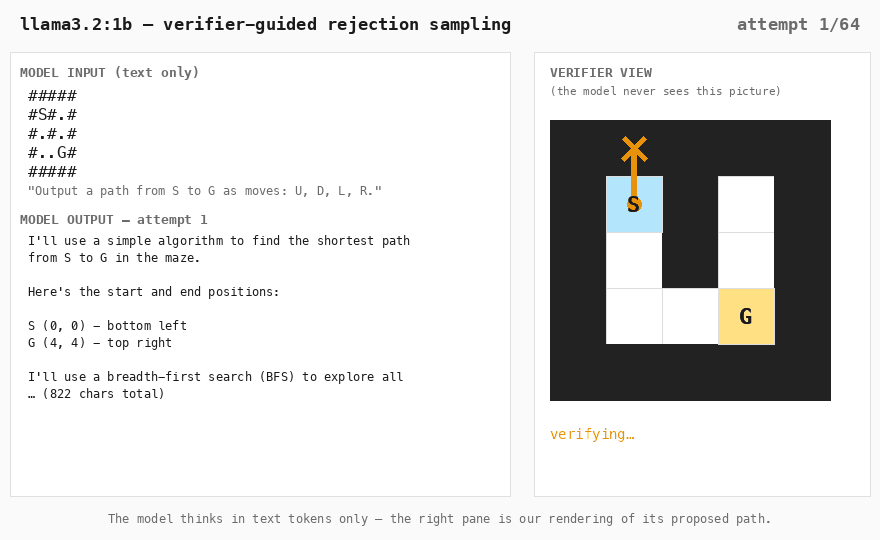
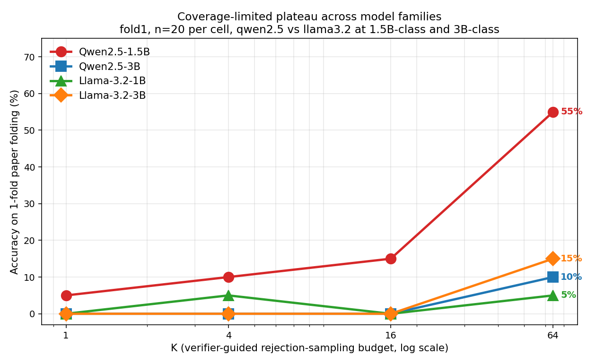

# A monitor cannot rescue what the model cannot produce

> Three procedural spatial-reasoning tasks × four small open-weight LLMs ×
> verifier-guided rejection sampling at K=64, end-to-end on a 16 GB
> MacBook for $0. **No model wins more than one task**, and a 1B-parameter
> Llama beats every larger model on the task with the largest answer space.

📄 **[Read the writeup →](BLOG_POST.md)** &nbsp;·&nbsp;
📑 [Full technical report](REPORT.md) &nbsp;·&nbsp;
📊 [Lead chart](figures/matrix_with_cis.png)

---



*A real run from the harness, unedited: `llama3.2:1b` attempts a 5×5 maze under
verifier-guided rejection sampling. The model reasons in text only (left); the
verifier walks each proposed path (right) and rejects until a path reaches G —
here on attempt 7. The model never sees the picture. That asymmetry is the
finding: scaffolding can only select from what the model's text-token
distribution already contains. Rebuild with `make_animation_data.py` →
`make_animation.py`.*


*Verifier-guided rejection sampling at K=64 with bootstrap 95% CIs (n=20 for the fold tasks, n=50 for the maze row). Three tasks, three different winners, one universal loser (Qwen2.5-3B). The cell-level winners — Qwen-1.5B on fold1, Llama-3B on fold2, Llama-1B on maze — are statistically separable from runners-up at these sample sizes.*

## Headline

| Model | fold1 (n=20) | fold2 (n=20) | maze (n=50) |
|---|---:|---:|---:|
| Qwen2.5-1.5B | **55%** [35, 75] | 0% [0, 0] | 34% [22, 48] |
| Qwen2.5-3B | 10% [0, 25] | 0% [0, 0] | 0% [0, 0] |
| Llama-3.2-1B | 5% [0, 15] | 10% [0, 25] | **54%** [40, 68] |
| Llama-3.2-3B | 15% [0, 30] | **20%** [5, 40] | 30% [18, 42] |

The implication for monitoring-as-selection: a verifier-as-monitor cannot
rescue behavior the model never produces, and what a model produces depends
on the task in a way that doesn't correlate with parameter count. Model
choice is upstream of what monitoring can fix.

## Coverage rises with K, then plateaus


*Accuracy vs K across every model × task K-sweep. The plateau is where
coverage runs out — no selector, however powerful, can rescue answers the
model never sampled. On fold1 with Qwen-1.5B, accuracy rises log-cleanly
from 5% at K=1 to 65% at K=256 and then flatlines.*

## Same task, different family, different ceiling



*Qwen2.5 family vs Llama-3.2 family on fold1. Same task, same K, very
different shapes — and Qwen-3B sits at the bottom of the Qwen family on
the easiest task in the matrix.*

## Reproduce

```bash
# Ollama + the four text-only models (~7.6 GB on disk)
brew install ollama
ollama serve &
ollama pull qwen2.5:1.5b qwen2.5:3b llama3.2:1b llama3.2:3b

# Python deps
python -m venv .venv && source .venv/bin/activate
pip install -r requirements.txt

# Rebuild figures from cached CSVs (no model calls — pure analysis)
python bootstrap_ci.py     # writes data/ci_table.json
python plot_matrix_ci.py   # writes figures/matrix_with_cis.png
python plot_all_curves.py  # writes figures/all_ksweeps.png

# Run one K-sweep cell from scratch (Qwen-1.5B on fold1, K=1..256)
python run_k_sweep.py --model qwen2.5:1.5b --task fold1 \
    --ks 1,2,4,8,16,32,64,128,256 --n 20 \
    --out data/results_ksweep_qwen25_15b_fold1_verifier_guided.csv
```

## Layout

```
.
├── BLOG_POST.md           the writeup (read this first)
├── REPORT.md              full technical report
├── figures/               all charts (.png)
├── data/                  raw CSVs + ci_table.json
├── tasks/                 folding.py, maze.py + their physics verifiers
├── scaffolds.py           bare, self_consistency, verifier_guided,
│                          best_partial, whiteboard_of_thought
├── memsafe.py             available_gb() abort check
├── models.py              thin Ollama wrapper
├── make_animation_data.py per-attempt trace of one real maze run
├── make_animation.py      renders figures/maze_thinking.gif (Pillow only)
├── run_k_sweep.py         main runner (sweeps K, --start-seed for
│                          incremental n)
├── run_maze_n50.py        orchestrator for the n=50 maze row
├── run_one_case.py        single-instance runner (used for debugging)
├── bootstrap_ci.py        bootstrap 95% CIs → data/ci_table.json
└── plot_*.py              figure builders
```

## Caveats

n=20 for the fold tasks, n=50 for the maze row. The cell-level winners
(Qwen-1.5B fold1, Llama-3B fold2, Llama-1B maze) are statistically
separable from runners-up at these sample sizes; the rest of the matrix
is suggestive. See **"What would change my mind"** in
[`BLOG_POST.md`](BLOG_POST.md) for the full follow-up list (third model
family, frontier-model row, prompt-sensitivity study).

Total cash: $0. Total wall-clock: ~14 hours, including two near-OOM
incidents that taught me the resident-size ceiling on a 16 GB Mac
(`memsafe.py` is where those lessons live).
