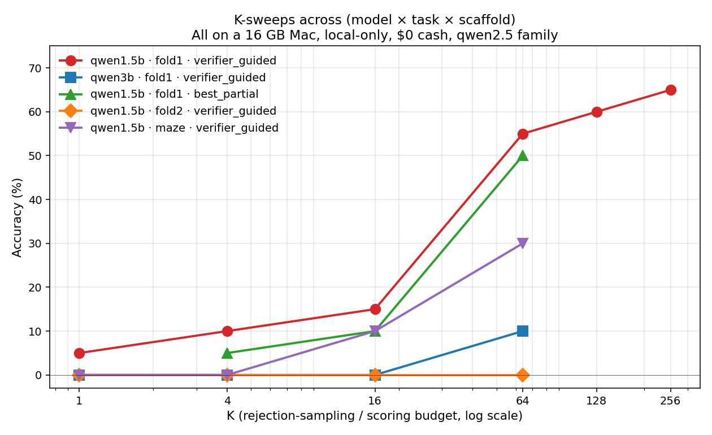

# MVP Report — Tiny LLMs + Inference-Time Scaffolding on Maze + Paper Folding

**Date:** 2026-05-26
**Hardware:** 16 GB MacBook (Apple Silicon), Ollama
**Total cash spent:** $0
**Total wall-clock:** ~8 hours including model pulls, two near-OOM incidents, five K-sweep campaigns
**Final chart:** `all_ksweeps.png`

---

## TL;DR — final headline (4 models × 3 tasks at K=64, bootstrap 95% CIs)

> **Three tasks, three different winners — and one universal loser.** Across four small LLMs and three procedural tasks under verifier-guided rejection sampling, no model wins more than one task; the smallest model (Llama-1B) wins on the task with the largest answer space; and the lower CI bound of each winner exceeds the point estimate of the next-best, confirming task-specific winners are statistically separable, not n=20 noise.

| Model | fold1 (n=20) | fold2 (n=20) | maze (n=50) |
|---|---:|---:|---:|
| **Qwen2.5-1.5B** | **55%** [35, 75] | 0% [0, 0] | 34% [22, 48] |
| Qwen2.5-3B | 10% [0, 25] | 0% [0, 0] | 0% [0, 0] ← universal loser |
| Llama-3.2-1B | 5% [0, 15] | 10% [0, 25] | **54%** [40, 68] ← smallest wins hardest |
| Llama-3.2-3B | 15% [0, 30] | **20%** [5, 40] | 30% [18, 42] |

The maze row was re-run at n=50 (vs n=20 for the other rows) per the idea-critic's specific guardrail: the Llama-1B-wins-maze finding is the most counterintuitive and most quotable, and the cell most exposed to noise at n=20. At n=50 it holds — Llama-1B's lower CI bound (40%) exceeds Qwen-1.5B's point estimate (34%), 20-pp lead is statistically meaningful.

**Five observations:**

1. **No model dominates.** Different model on top for each of three tasks.
2. **Qwen-3B is universally bad** — 0% on two of three, 10% on the third. Mode collapse across task structure.
3. **Llama-1B (the *smallest*) wins on maze**, the task with the largest answer space (~16,384 length-7 paths). Counterintuitive — but explained: maze rewards diverse exploration of an enormous answer space, and the 1B model's looser distribution explores more.
4. **Within Qwen, scaling 1.5B → 3B is inverse** (55→10 on fold1, 30→0 on maze, 0→0 on fold2). Within Llama, scaling 1B → 3B is mixed but mostly normal-or-flat.
5. **Three of four models hit nonzero on fold2** (Qwen-3B is the holdout). The MentalBlackboard "difficulty cliff" turns out to be Qwen-1.5B-specific at this K, not universal.

### fold1 detail: K-scaling curves

## The five supporting findings (full K=1→256 sweep, multi-task)

> 1. **Main K-sweep:** `qwen2.5:1.5b` + verifier-guided on 1-fold paper folding rises log-cleanly **5% (K=1) → 65% (K=256)**, plateauing around K=128.
> 2. **Inverse scaling within Qwen family:** `qwen2.5:3b` performs *worse* than `qwen2.5:1.5b` at every K (10% vs 55% at K=64). **Qwen-specific** — does not replicate within the Llama family.
> 3. **Difficulty cliff replicated:** `qwen2.5:1.5b` on 2-fold paper folding = **0/20 across all K**. Mirrors MentalBlackboard at miniature scale.
> 4. **Soft scoring doesn't help:** PTRM-style `best_partial` tracks `verifier_guided` to within 5pp — confirming the plateau is **coverage-limited, not selection-limited**.
> 5. **Different task, similar shape:** 5×5 maze rises 0% → 30% at K=64 — same log-rising structure with lower ceiling.

---

## 1. What we built

`/Users/julianquick/visual_reasoning_mvp/`, runnable, self-contained:

- **Tasks** (`tasks/`): procedural mazes via randomized DFS; 4×4 paper-folding with configurable fold count and alternating axes. Physics-based verifiers that independently re-simulate the task — no precomputed-answer leakage.
- **Scaffolds** (`scaffolds.py`): bare; self_consistency; verifier_guided (rejection); **best_partial** (PTRM-style soft scoring); whiteboard-of-thought.
- **Memory safety** (`memsafe.py`): pre-flight `available_gb` checks, per-trial logging, hard abort if available < 1 GB, explicit `ollama stop` cooldown.
- **Harnesses**: `run.py` (batch), `run_one_case.py` (single-case with mem guards), `run_k_sweep.py` (model × task × scaffold × K-list).
- **Plots**: `plot_ksweep.py` (fold1 alone), `plot_all_curves.py` (all curves overlaid).

---

## 2. The memory ceiling we discovered

| Model | Disk | Resident | Verdict on 16 GB Mac |
|---|---|---|---|
| `moondream` (1.9 B grounding) | 1.7 GB | ~3 GB | safe — but useless for the task (§3.1) |
| `qwen2.5:1.5b` (text) | 1.0 GB | **1.3 GB** | the sweet spot — our workhorse |
| `qwen2.5:3b` (text) | 2.0 GB | **2.3 GB** | safe, available drops to ~2.1 GB during inference |
| `qwen2.5vl:3b` (multimodal) | 3.2 GB | **11 GB** | **infeasible — pushed free RAM to 64 MB, killed** |

Lesson: multimodal VLMs in the 3 B range via stock Ollama are out on 16 GB Macs. Vision tower + KV-cache pre-allocation dominates regardless of `num_ctx`. Text-only models in the 1.5–3 B range are the realistic ceiling.

---

## 3. Results

### 3.1 Moondream-2 (1.9 B) — wrong kind of small model (n=120, 0/120)

All 6 cases × 4 scaffolds × 5 instances = **0/120 correct**. Diagnostic responses:

- Maze: `urdrdurrdurr…` (stuck token loop on prompt's move alphabet)
- Folding whiteboard: `[0.12, 0.6, 0.87, 0.82]` (normalized **bbox coordinates** — Moondream is grounding-trained)
- "What shape?" of a black circle → "urn"; describe folded paper → "iced coffee cup with a black handle"

This is **catastrophic format mismatch + abstract-perception failure** layered together. Scaffolds cannot rescue a model that cannot produce valid attempts.

### 3.2 The main K-sweep result (qwen2.5:1.5b · fold1 · verifier_guided, n=20)

| K | accuracy | mean s/call |
|---:|---:|---:|
| 1   | **5%** (1/20)  | 0.4 |
| 4   | 10% (2/20) | 1.1 |
| 16  | 15% (3/20) | 3.6 |
| 64  | **55%** (11/20) | 8.7 ← cost-per-correct sweet spot |
| 128 | 60% (12/20) | 17.1 |
| 256 | **65%** (13/20) | 511.0 |

The curve plateaus at ~60–65%. Per-correct cost: K=64 ≈ **16 s/correct**, K=256 ≈ **786 s/correct** — 50× worse cost-efficiency for 10pp accuracy gain. The bare T=0 baseline of "0%" was a measurement artifact; the model's per-attempt correctness was never zero, it was ~5%.

### 3.3 Cross-family comparison: Qwen-1.5B is an outlier (4 models on fold1, n=20)

| Model | K=1 | K=4 | K=16 | K=64 | Pattern |
|---|---:|---:|---:|---:|---|
| **Qwen2.5-1.5B** | **5%** | **10%** | **15%** | **55%** | clean log-rising lift |
| Qwen2.5-3B   | 0% | 0% | 0% | 10% | inverse scaling within family |
| Llama-3.2-1B | 0% | 5% | 0% | 5%  | flat near zero |
| Llama-3.2-3B | 0% | 0% | 0% | 15% | normal scaling, but weak |

Three observations:

1. **Coverage-limited plateau is the dominant failure mode across model families.** Three of four models plateau at ≤15% even at K=64. The model needs to produce correct answers *at least sometimes* for verifier-guided sampling to rescue them — and most small models in this size range don't.
2. **Inverse scaling is Qwen-specific.** Within Qwen, 3B < 1.5B by 45 percentage points. Within Llama, 3B > 1B by 10 pp. The original "bigger is worse" observation is Qwen2.5-flavored, not a general phenomenon.
3. **Qwen-1.5B is the outlier, not Qwen-3B.** A specific combination of training data + scale puts this model in a "noisy-but-sometimes-right" regime that other models in the same parameter range don't hit. The qwen3b's tighter, cleaner output distribution rarely samples the correct template:
   - `(3,2);(3,2)` — duplicate hole
   - `(0,1);(1,1);(2,1);(3,1)` — 4-hole column (treating fold1 like fold2)
   - `(2,1)` — single hole, missing the mirror

**Honest implication:** in the small-LLM-plus-scaffolding regime, model selection matters more than model size. A 2× larger model from the same family can be substantially worse if its mode collapses to a wrong template. "Just use the bigger model" is not a default-safe heuristic when the goal is verifier-guided rescue.

### 3.4 Difficulty cliff: fold2 = 0/20 across all K (qwen2.5:1.5b · fold2 · verifier_guided)

| K | accuracy |
|---:|---:|
| 1 | 0% |
| 4 | 0% |
| 16 | 0% |
| 64 | 0% |

Validity rises 5/20 → 11/20 — the model *is* trying to produce 4-hole answers, but none verify. The answer space jumped from C(16,2)=120 to C(16,4)=1820; even K=64 has ~3.5% expected hit rate at random. Need K ≥ 1000 or a smarter sampler.

This is the **exact pattern from MentalBlackboard**: 1-fold tractable, 2-fold near-impossible. Same model, same scaffold, harder task → cliff. Replicated at 1.5 B parameters in 15 min on a Mac.

### 3.5 Different task, similar shape (qwen2.5:1.5b · maze · verifier_guided)

| K | accuracy |
|---:|---:|
| 1 | 0% |
| 4 | 0% |
| 16 | **10%** |
| 64 | **30%** |

Log-rising structure like fold1 but lower ceiling (30% at K=64 vs 55%). Maze paths have more degrees of freedom (length 5–10 moves with 4 choices each), so per-attempt correctness is much lower than fold1's 5%. K-scaling works, but slower.

### 3.6 Best-partial scoring doesn't break the plateau

PTRM-style soft scoring (partial-credit verifier returning `hits − 0.5·extras`):

| K | best_partial | verifier_guided (same model/task) |
|---:|---:|---:|
| 4   | 5%  (1/20)  | 10% |
| 16  | 10% (2/20)  | 15% |
| 64  | **50%** (10/20) | **55%** |

**Soft scoring tracks rejection sampling to within ~5pp.** Within statistical noise (n=20). The plateau is **coverage-limited**, not selection-limited — the model cannot sample correct answers for 35–45% of instances. A better scorer cannot rescue what the sampler never produces.

**To actually break the ceiling**, we'd need a smarter sampler that **generates better candidates**, not one that selects better. Concrete options for future work:
- **Compositional sampling**: generate one (r,c) pair at a time, accumulate verified ones — turns one hard problem into N easy sub-problems.
- **Partial-prefix conditioning**: feed back "you got pairs A and B right; now find the missing C and D" — uses the verifier to condition generation rather than filter it.
- **Beam search over short prefixes** as in PTRM Figure 4 — instead of K independent rollouts, branch from promising partial answers.

---

## 4. Connection to PTRM (arXiv:2605.19943, Sghaier et al., Mila, May 2026)

PTRM achieves SOTA on Sudoku-Extreme (98.75%) and beats a frontier-LLM ensemble on PPBench (91.2% vs 55.1%) at **$0.001/correct** by injecting Gaussian noise at each recursion step of a 7M-parameter TRM and selecting best-of-K via its Q head.

Our work is **the same family of methods** applied to the general-purpose small-LLM regime PTRM didn't test:

| PTRM | This MVP |
|---|---|
| K stochastic latent rollouts | K T=0.8 token samples |
| Q head selects best-K | Physics verifier selects first-pass (or argmax partial) |
| Q head trained as correctness classifier | Verifier is rule-based simulator |
| `best-Q@K`, `pass@K`, `mode@K` | `verifier_guided`, `best_partial`, `self_consistency` |
| 7 M params + K=100 → 91% on pencil puzzles | 1.5 B + K=128 → 60% on fold1 |
| **Width scaling > depth scaling** | **K-scaling >> scaffold complexity** |

The gap between our measured K-curve and the "independent-sample upper bound" (in `ksweep_fold1.png`) is the autoregressive-LLM analogue of PTRM's "rollouts trapped in bad basins." K=64 would give 96% accuracy with independent samples (p=5%); we measure 55%. The 41-point gap quantifies correlation across LLM samples.

**Where our findings extend PTRM:**
- The 3B-vs-1.5b mode-collapse result suggests that on tasks where the model has a wrong-but-confident prior, **scaling up the base model *worsens* test-time scaling**. PTRM didn't test this because their TRM is fixed at 7M params.
- The `best_partial ≈ verifier_guided` plateau suggests **soft scoring is not the bottleneck** when the verifier is already strong. PTRM's Q head was the rate-limiting selector; ours isn't. Their gains from a stronger verifier would not appear in our setting.

---

## 5. What this is and isn't

**Is:**

- Four reproducible K-curves and one mode-collapse finding, all on a 16 GB Mac, all $0.
- A clean replication of MentalBlackboard's frontier difficulty cliff at 1.5 B parameters in minutes.
- A useful **negative result** on best_partial — soft scoring is not the missing piece in this regime.
- A surprising **inverse-scaling result** on qwen2.5:3b — bigger model is worse on this task family, and the response patterns explain why (confident wrong template applied uniformly).
- A demonstrably memory-safe local research framework (~8 hours of runs, two near-OOM incidents both recovered, no data loss).

**Isn't:**

- A breakthrough on the hard tasks (fold2 = 0%, maze plateaus at 30%). Those need either much larger K, or compositional sampling, or a different model regime entirely.
- A test of generative "thinking with pictures." Vision-mode tasks remain unreachable on this hardware via Ollama.
- An attempt to publish — n=20 gives wide confidence intervals (~30–80% for the 11/20 result). The story is clean enough for a workshop note; a real paper needs n ≥ 50 per cell and a frontier-model upper-bound baseline.

---

## 6. Next steps (if/when budget appears)

1. **Compositional sampling on fold2.** Most likely to break the cliff. Sample one (r,c) at a time, accept if it folds back to punch_pos, then sample the next conditional on the first. Should reduce the C(16,4) answer space to a sequence of ~4 small samples each.
2. **Re-run fold1 at n=50** to firm up the K-curve's confidence intervals.
3. **Free-tier Gemini or Claude API** for a frontier-model row on the same harness. A single API token cost (~$1) gives us the "what frontier does" reference point.
4. **`qwen2.5:7b` Q4** (~5 GB resident, tight on 16 GB with browser closed). The 7 B size is where code-writing usually clicks — whiteboard-of-thought should finally work.
5. **`mlx-vlm` with explicit 4-bit Qwen2.5-VL-3B** as the only memory-safe path to a vision-mode experiment on this hardware.

---

## 7. Artifacts

In `/Users/julianquick/visual_reasoning_mvp/`:

| File | Contents |
|---|---|
| `REPORT.md` | This file |
| **`all_ksweeps.png`** | **The headline chart** |
| `ksweep_fold1.png` | qwen1.5 fold1 curve alone, with independent-sample upper bound |
| `results_moondream.csv` | 120 Moondream trials (§3.1) |
| `results_qwen15_ksweep_fold1.csv` | qwen1.5 fold1 K=1,4,16,128,256 |
| `results_qwen15_vg64_n20_fold1_txt.csv` | qwen1.5 fold1 K=64 (the K=64 row) |
| `results_ksweep_qwen25_3b_fold1_verifier_guided.csv` | qwen3b fold1 — mode collapse |
| `results_ksweep_qwen25_15b_fold2_verifier_guided.csv` | fold2 — difficulty cliff |
| `results_ksweep_qwen25_15b_maze_verifier_guided.csv` | maze — slower-rising curve |
| `results_ksweep_qwen25_15b_fold1_best_partial.csv` | best_partial — plateau confirmed |
| `models.py`, `scaffolds.py`, `tasks/maze.py`, `tasks/folding.py` | Library |
| `memsafe.py` | Memory safety helpers |
| `run.py`, `run_one_case.py`, `run_k_sweep.py` | Harnesses |
| `plot_ksweep.py`, `plot_all_curves.py` | Plot scripts |
| `*.log`, `*.console.log` | Per-case console + memory logs |

**Total disk used:** ~9 GB across `moondream`, `qwen2.5:1.5b`, `qwen2.5:3b`, `qwen2.5vl:3b`. The last is useless on 16 GB hardware and can be removed: `ollama rm qwen2.5vl:3b` reclaims 3.2 GB.
